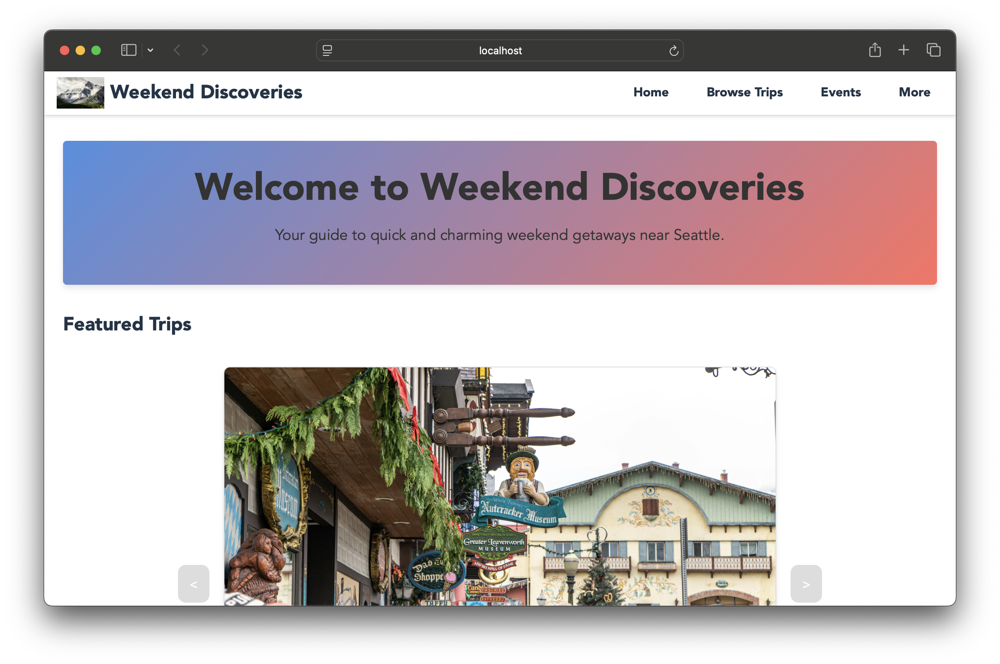
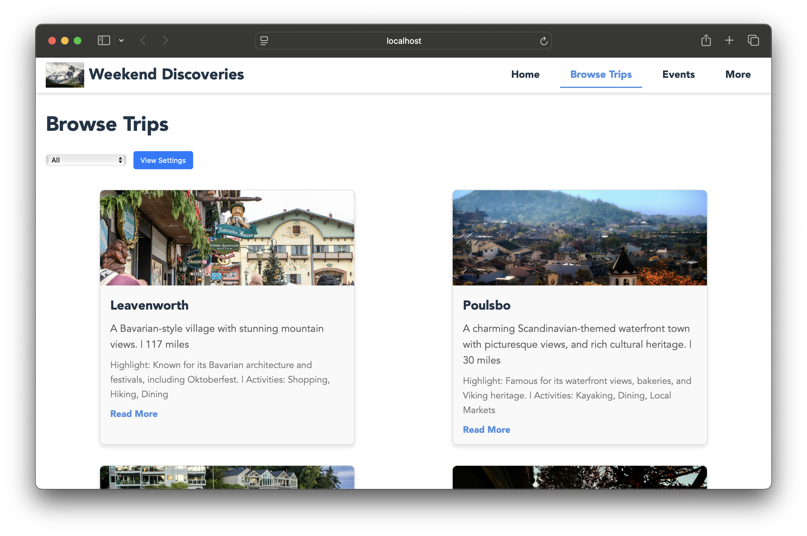
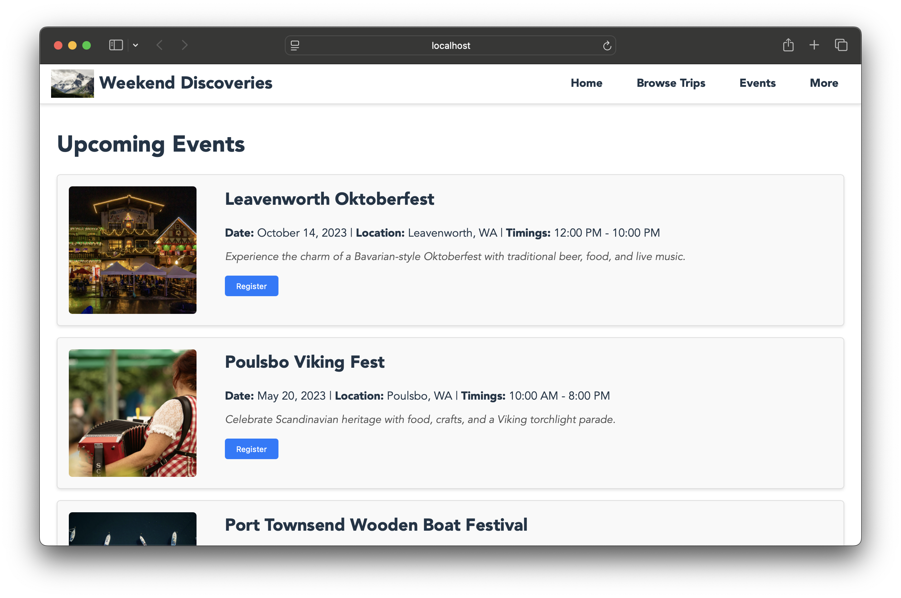
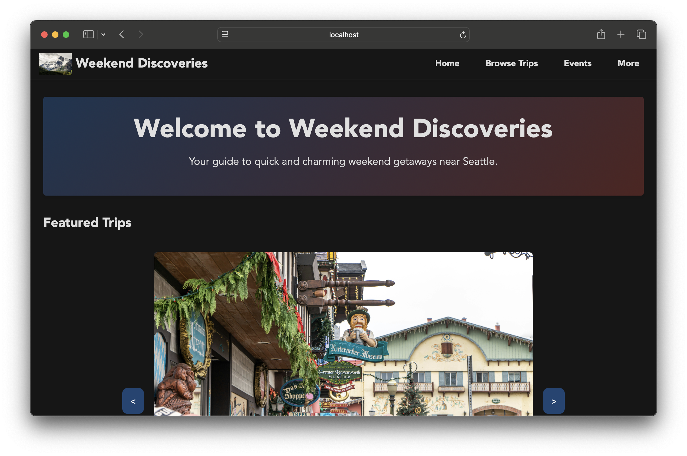

# Weekend Discoveries


A responsive web application for discovering weekend getaways near Seattle, featuring an interactive UI with a focus on accessibility and user experience.

<div align="center">
  
  
</div>

<div align="center">
  
  
</div>

## Table of Contents

1. [Introduction](#introduction)
2. [Features](#features)
3. [Technologies Used](#technologies-used)
4. [Architecture](#architecture)
5. [UI Components](#ui-components)
6. [Setup Instructions](#setup-instructions)
7. [Design Philosophy](#design-philosophy)
8. [Accessibility](#accessibility)
9. [Future Enhancements](#future-enhancements)

## Introduction

Weekend Discoveries is a web application designed to help users find quick weekend getaways around Seattle. This project showcases modern web development principles including component-based architecture, responsive design, and accessibility best practices.

## Features

- **Interactive Trip Discovery**: Browse curated weekend destinations with comprehensive information
- **Dynamic UI Components**: Responsive layout with theme toggling (light/dark mode)
- **Detailed Trip Information**: Each destination includes travel times, activities, and local insights
- **Seasonal Events Calendar**: Discover local festivals and events happening throughout the year
- **Accessibility-First Design**: Fully navigable by keyboard with proper ARIA attributes
- **Mobile-Responsive Interface**: Optimized for all device sizes
- **Local Travel Tips**: Curated information about hidden spots, restaurants, and accommodations

## Technologies Used

<table>
  <tr>
    <th>Technology</th>
    <th>Purpose</th>
    <th>Implementation Details</th>
  </tr>
  <tr>
    <td>React 18</td>
    <td>UI Library</td>
    <td>Functional components, Hooks (useState, useEffect, useRef)</td>
  </tr>
  <tr>
    <td>Vite</td>
    <td>Build Tool</td>
    <td>Fast HMR, optimized builds, dev server</td>
  </tr>
  <tr>
    <td>CSS3</td>
    <td>Styling</td>
    <td>Component-scoped CSS, CSS variables, Flexbox/Grid</td>
  </tr>
  <tr>
    <td>ESLint</td>
    <td>Code Quality</td>
    <td>React-specific rules, accessibility linting</td>
  </tr>
  <tr>
    <td>JavaScript ES2020</td>
    <td>Programming Language</td>
    <td>Modern JS features, modules, destructuring</td>
  </tr>
</table>

## Architecture

The application follows a component-based architecture with React:

- **Pages**: High-level components representing entire views (Home, BrowseTrips, Events)
- **Components**: Reusable UI elements (Card, Header, Footer)
- **Hooks**: Functional React hooks for state management and side effects
- **Data**: Static data modules providing content for trips and events

### Key Structure:

```
src/
├── components/      # Reusable UI components
├── pages/           # Page-level components
├── styles/          # CSS modules for styling
├── data/            # Trip and event data
├── App.jsx          # Main application component
└── main.jsx         # Application entry point
```

## UI Components

The application leverages several reusable components:

| Component | Description |
|-----------|-------------|
| Card | Displays destination information in a visually appealing card format |
| Cards | Container component that manages multiple Card components |
| Header | Navigation and theme control component |
| Footer | Site footer with important links |
| Modal | Reusable modal dialog component |
| LayoutSettingsModal | Specialized modal for changing layout preferences |

## Setup Instructions

### Prerequisites:
- Node.js (v16 or higher)
- npm (v8 or higher)

### Installation:

1. Clone the repository:
```sh
git clone https://github.com/anusha24n/WeekendDiscoveries.git
cd WeekendDiscoveries
```

2. Install dependencies:
```sh
npm install
```

3. Start development server:
```sh
npm run dev
```

4. Build for production:
```sh
npm run build
```

5. Preview production build:
```sh
npm run preview
```

## Design Philosophy

Weekend Discoveries follows these key design principles:

1. **User-Centric Design**: Intuitive navigation and clear information hierarchy
2. **Accessibility First**: Built with accessibility in mind from the ground up
3. **Performance Optimization**: Fast load times and smooth interactions
4. **Responsive Design**: Adapts seamlessly to different screen sizes
5. **Visual Appeal**: Engaging imagery and thoughtful color schemes

## Accessibility

This project implements WCAG 2.1 guidelines including:

- Proper semantic HTML structure
- Keyboard navigation support
- ARIA labels and attributes
- Focus management
- Color contrast compliance
- Skip navigation links
- Screen reader compatibility

## Future Enhancements

Planned future improvements include:

- User accounts and saved trips
- Interactive map integration
- Weather forecasts for destinations
- Trip planning and itinerary tools
- User reviews and ratings
- Backend integration
- Progressive Web App capabilities

## Course Information

This project was developed as part of the Web Design and User Experience Engineering course in the MS in Information Systems program at Northeastern University. It demonstrates skills in:

- Front-End Development
- UI/UX Design
- Responsive Web Design
- Accessibility Implementation
- Modern JavaScript Frameworks

